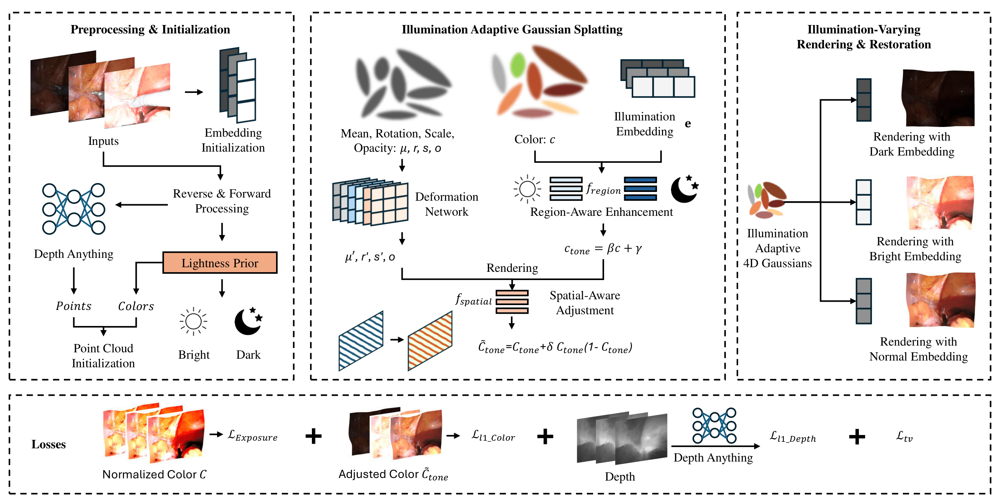

<p align="center">

  <h1 align="center">Endo-4DGX: Robust Endoscopic Scene Reconstruction and Illumination Correction with Gaussian Splatting</h1>

  <h2 align="center">MICCAI 2025</h2>
  <p align="center">
    <a href="https://github.com/lastbasket"><strong>Yiming Huang*</strong></a>,
    <a href="https://longbai-cuhk.github.io/"><strong>Long Bai*</strong></a>,
    <a href="https://beileicui.github.io/"><strong>Beilei Cui*</strong></a>,
    <strong>Yanheng Li</strong>,
    <a href="https://davismeee.github.io/"><strong>Tong Chen</strong></a>,
    <br>
    <strong>Jie Wang</strong>,
    <strong>Jinlin Wu</strong>,
    <strong>Zhen Lei</strong>,
    <strong>Hongbin Liu</strong>,
    <a href="https://www.ee.cuhk.edu.hk/ren/"><strong>Hongliang Ren</strong></a>
  </p>
  <h3 align="center"> || <a href="https://arxiv.org/abs/2506.23308">Paper</a> || <a href="https://lastbasket.github.io/MICCAI-2025-Endo-4DGX/">Project Page</a> || </h3>
  <div align="center"></div>
</p> 
<p align="center">
  <a href="https://lastbasket.github.io/MICCAI-2025-Endo-4DGX/">
    
  </a>
</p>

## Citation
```
@misc{huang2025endo4dgxrobustendoscopicscene,
      title={Endo-4DGX: Robust Endoscopic Scene Reconstruction and Illumination Correction with Gaussian Splatting}, 
      author={Yiming Huang and Long Bai and Beilei Cui and Yanheng Li and Tong Chen and Jie Wang and Jinlin Wu and Zhen Lei and Hongbin Liu and Hongliang Ren},
      year={2025},
      eprint={2506.23308},
      archivePrefix={arXiv},
      primaryClass={cs.CV},
      url={https://arxiv.org/abs/2506.23308}, 
}
```
<p align="center">
